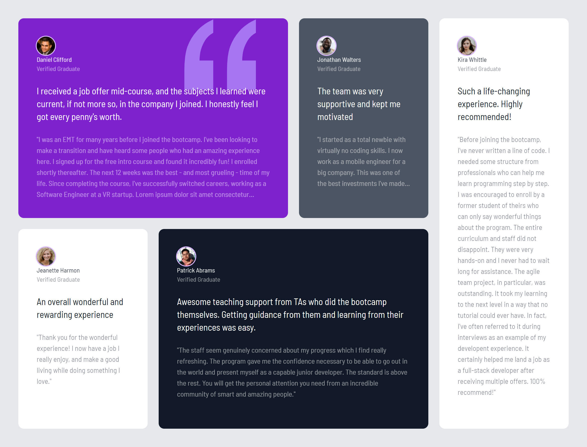

# Frontend Mentor - Testimonials grid section solution

This is a solution to the [Testimonials grid section challenge on Frontend Mentor](https://www.frontendmentor.io/challenges/testimonials-grid-section-Nnw6J7Un7). Frontend Mentor challenges help you improve your coding skills by building realistic projects. 

## Table of contents

- [Overview](#overview)
  - [The challenge](#the-challenge)
  - [Screenshot](#screenshot)
  - [Links](#links)
- [My process](#my-process)
  - [Built with](#built-with)
- [Author](#author)
- [Acknowledgments](#acknowledgments)

## Overview

### The challenge

Users should be able to:

- View the optimal layout for the site depending on their device's screen size

### Screenshot

### Links

- Solution URL: [https://github.com/GioKhabu/Testimonial_Grid.git]
- Live Site URL: [https://testimonial-grid-pi-mocha.vercel.app/]

## My process

### Built with

- Semantic HTML5 markup
- Tailwind CSS
- CSS Grid
- Mobile-first workflow

## Author

- GitHub - [GioKhabu](https://github.com/GioKhabu)
- Frontend Mentor - [@GioKhabu](https://www.frontendmentor.io/profile/GioKhabu)
- Linkedin - [@Giorgi Khaburzania](https://www.linkedin.com/in/giorgi-khaburzania-92010272/)

## Acknowledgments

Created within Brad Traversy's course about Tailwind CSS
